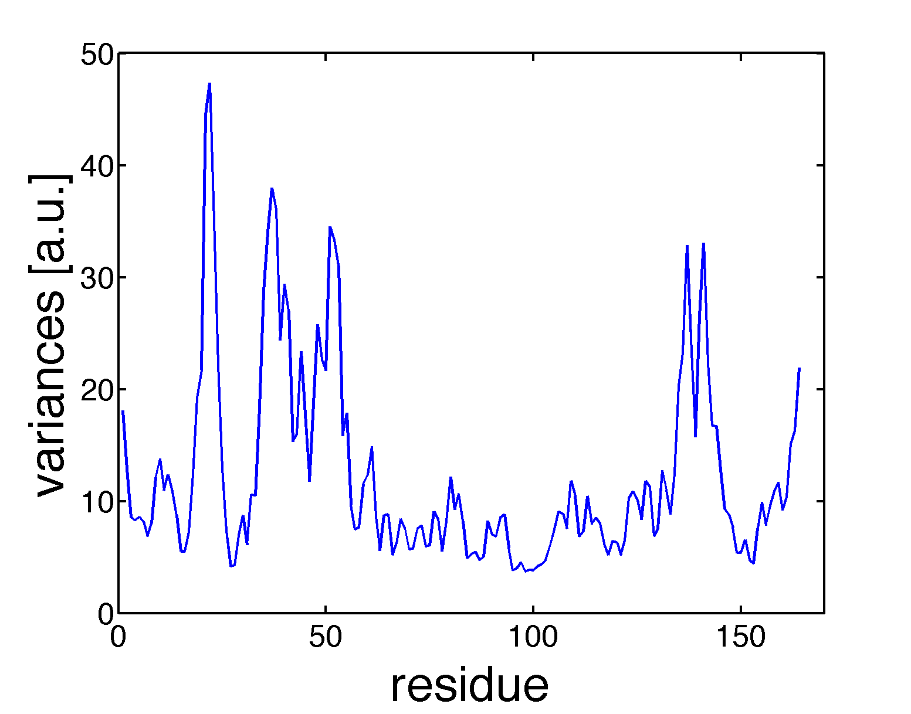
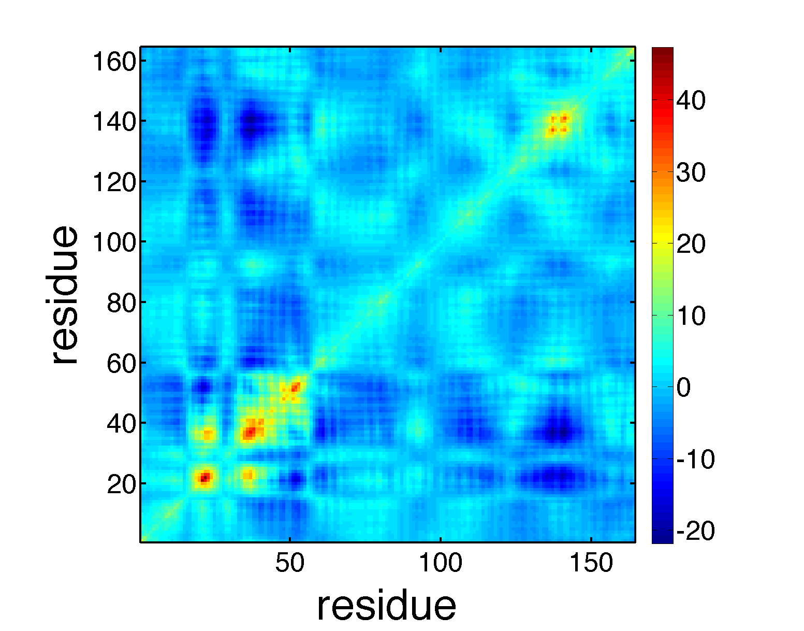
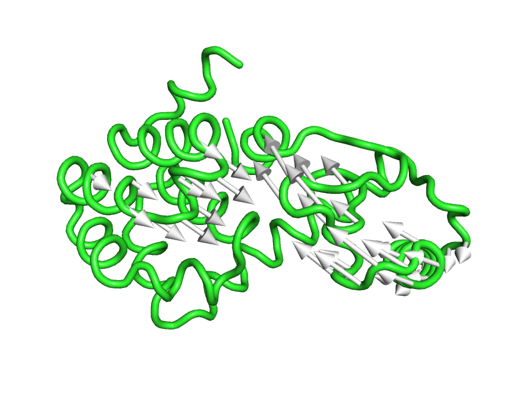
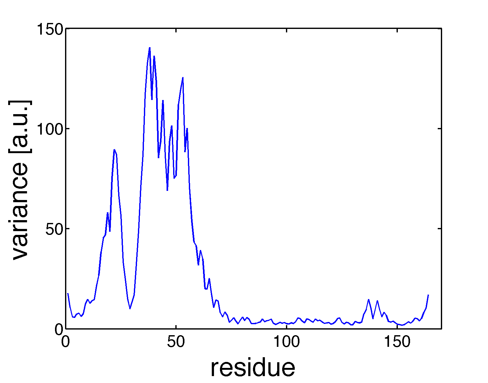
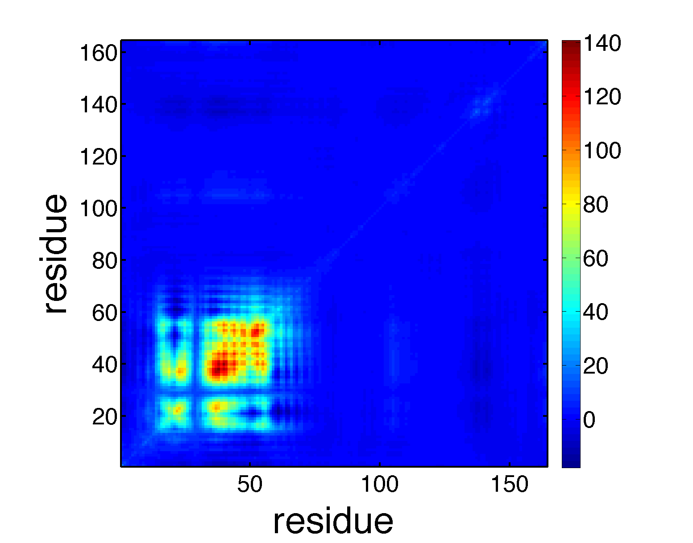
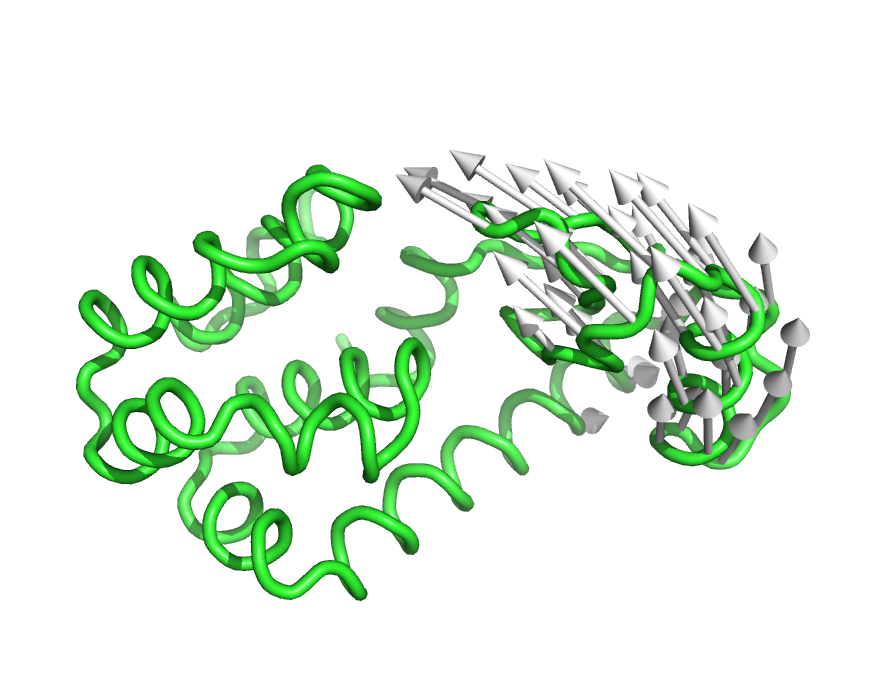

.. anm
.. highlight:: matlab

==============================================================
Anisotropic Network Model (anm)
==============================================================

Normal mode analysis of Ca-based anisotropic network model of T4 lysozyme. 
::

 [pdb, crd] = readpdb('lys.pdb');
 index_ca = selectname(pdb.name, 'CA');
 pdb = substruct(pdb, index_ca);
 crd = crd(to3(index_ca));
 crd = decenter(crd);
 [emode, frequency, covar, covar_atom] = anm(crd, 8.0);

Plot root-mean-square-fluctuations (RMSF) and covariances. 
::

 plot(diag(covar_atom)); xlabel('residue','fontsize',40); ylabel('variances [a.u.]','fontsize',40); formatplot
 imagesc(covar_atom); axis xy; axis square; 
 xlabel('residue','fontsize',40); ylabel('residue','fontsize',40); colorbar; formatplot2

Visualize mode structures, 
::

 pdb.xyz = reshape(crd, 3, [])';
 writepdb('lys_ca.pdb', pdb);
 crd1 = crd + emode(:, 1)'*50;
 pdb.xyz = reshape(crd1, 3, [])';
 writepdb('lys_ca1.pdb', pdb);

In PyMOL, 
::

 load lys_ca.pdb
 load lys_ca1.pdb
 run modevectors.py # you need to get modevectors.py
 set cartoon_trace_atoms, 1
 cartoon tube
 as cartoon
 modevectors lys_ca, lys_ca1

Transformation of frame
^^^^^^^^^^^^^^^^^^^^^^^

Transform from the Eckart frame to a non-Eckart frame.
::

 index_fixeddomain = [1:11 77:164];
 external_mode = emode(:,(end-5):end);
 [emode2, variances2, covar2, covar2_atom] = transformframe(index_fixeddomain, external_mode, covar);
 plot(diag(covar2_atom)); xlabel('residue','FontSize',40); ylabel('variance [a.u.]','FontSize',40); formatplot
 imagesc(covar2_atom); axis xy; axis square;
 xlabel('residue','FontSize',40); ylabel('residue','FontSize',40); colorbar; formatplot2

Visualize mode structures, 
::

 crd2 = crd + emode2(:, 1)'*50;
 pdb.xyz = reshape(crd2, 3, [])';
 writepdb('lys_ca2.pdb', pdb);

In PyMOL, 
::

 load lys_ca.pdb
 load lys_ca2.pdb
 run modevectors.py # you need to get modevectors.py
 set cartoon_trace_atoms, 1
 cartoon tube
 as cartoon
 modevectors lys_ca, lys_ca2

