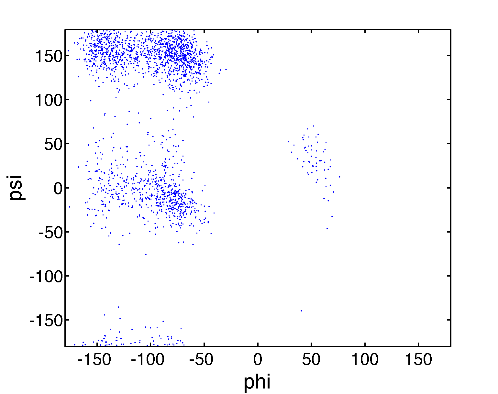
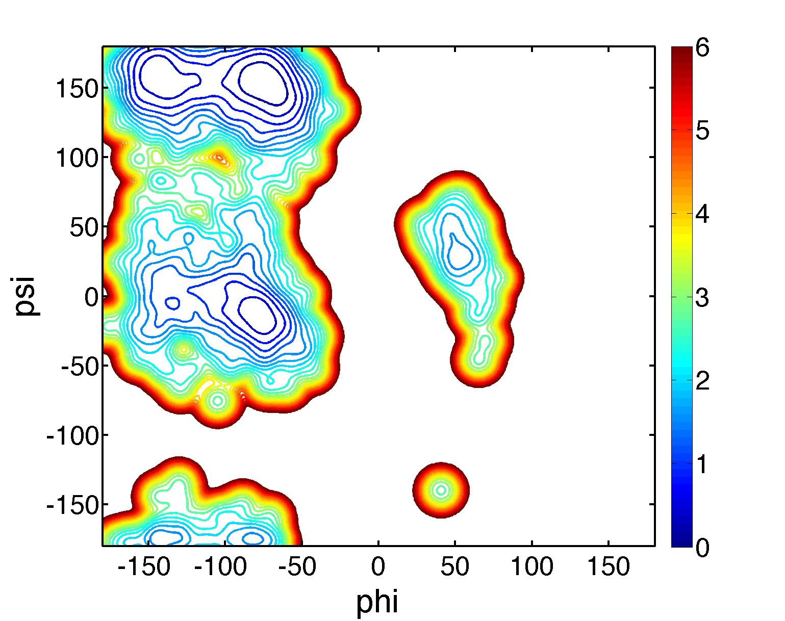

.. pmf
.. highlight:: matlab

==============================================================
Potential mean force (PMF) surface from scattered data
==============================================================

Here, we calculate the surface of potential of mean force (PMF) in a dihedral angle space. 
Molecular dynamics trajectory of alanine-dipeptide with TIP3P waters is used for the demonstration. 

First, we extract the dihedral angles from the trajectory: 
::

 % prepare index for dihedral angles
 index_phi = [5 7 9 15];
 index_psi = [7 9 15 17];
 index_phi3 = to3(index_phi);
 index_psi3 = to3(index_psi);
 
 % read trajectory
 trj = readnetcdf('ala.nc', 1:22);
 
 % calculate dihedral
 phi = calcdihedral(trj(:, index_phi3));
 psi = calcdihedral(trj(:, index_psi3));
 
 % convert the unit from radian to dgree
 phi = phi.*180./pi;
 psi = psi.*180./pi;

Next, we estimate the probability density function (PDF)
in the two-dimentional dihedral space from the scattered data (``phi`` and ``psi``).
This can be done by using the (bivariate) kernel density
estimation (``kde2d.m``), and the PMF is defined as minus log of the
PDF in the unit of KBT: 
::

 % scattered plot of the dihedral angles
 scatter(phi, psi, '.')
 axis xy;
 axis([-180 180 -180 180]);
 formatplot
 xlabel('phi', 'FontSize', 30, 'FontName', 'Helvetica'); 
 ylabel('psi', 'FontSize', 30, 'FontName', 'Helvetica');
 exportas('scatter');
 
 % calculate PMF and visualize the surface
 [z, xi, yi] = calcpmf2d([phi psi], 500); % calcpmf2d() calls kde2d()
 s = getconstants();                      % get Boltzmann constant in kcal/mol/K
 T = 300.0;                               % set temperature 
 z = s.KB*T*z;                            % convert unit from KBT to kcal/mol
 contour(xi, yi, z, 0:0.25:6, 'LineWidth', 2);
 axis([-180 180 -180 180]); axis xy; colorbar
 formatplot2;
 xlabel('phi', 'FontSize', 30, 'FontName', 'Helvetica'); 
 ylabel('psi', 'FontSize', 30, 'FontName', 'Helvetica');
 exportas('pmf2d');

Note that the kernel density estimator introduces some biases which
smooth out the 'true' PDF surface. So, we should be careful
especially when focusing on the barrier heights of PMF. 

