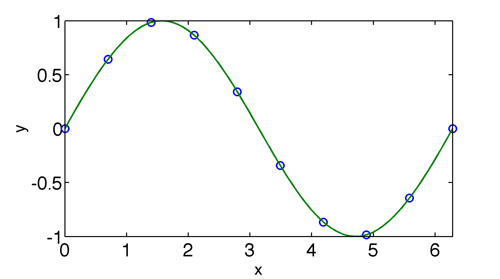
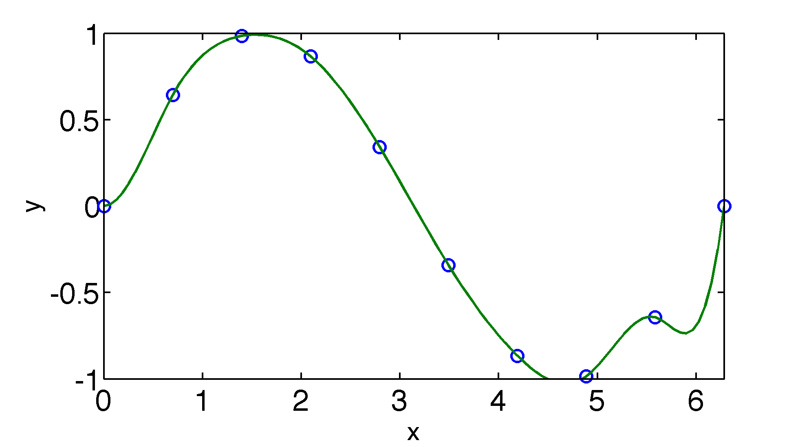
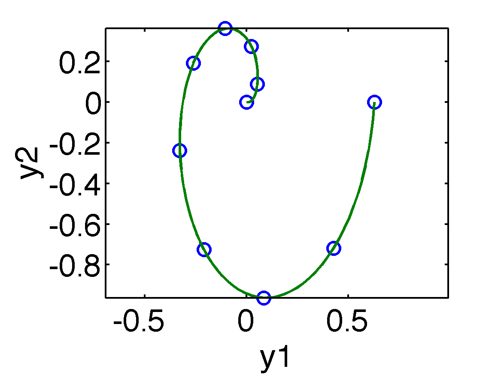

.. spline
.. highlight:: matlab

==============================================================
Cubic Spline interpolation (spline, ppval)
==============================================================

One-dimensional
---------------

MATLABの buit-in function である ``spline`` と ``ppval`` を使う。
sin関数を Cubic Spline 補間する例を示す。

::

 x = (2*pi) * linspace(0,1,10);
 y = sin(x);
 cs = spline(x, y);
 xx = (2*pi) * linspace(0, 1, 100);
 plot(x, y, 'o', xx, ppval(cs, xx), '-')

ここで変数 ``cs`` は、区分的多項式(piecewise polynomial)などの情報をも
つ構造体(structure)である。

(正確にはまだ確認していないが)
MATLABでは、デフォルトで、端点の2階微分がゼロという条件を使っており、
いわゆる natural cubic spline 補間がなされる。

端点の1階微分を指定して、いわゆる clamped cubic spline 補間をしたければ、
データ変数(``y``)の始めと終わりに1階微分の値を入れる。
以下に例を示す。
::

 x = (2*pi) * linspace(0, 1, 10);
 y = sin(x);
 cs = spline(x,[0.0 y 4.5]);
 xx = (2*pi) * linspace(0, 1, 100);
 plot(x, y, 'o', xx, ppval(cs, xx), '-')

Multi-dimensional
-----------------

1次元の場合と基本的には同様である。
データ変数 ``y`` の row が 変数に、 column がデータ点に対応する。
``ppval`` で出力される補間結果(ここでは ``yy``)も同様の並びになっている。
ここでは2次元の螺旋を補間する例を示す。
::

 x = (2*pi) * linspace(0, 1, 10);
 y1 = 0.1 * x .* cos(x);
 y2 = 0.2 * x .* sin(x);
 y = [y1; y2];
 cs = spline(x,y);
 xx = (2*pi) * linspace(0, 1, 100);
 yy = ppval(cs,xx);
 plot(y1, y2, 'o', yy(1,:), yy(2,:), '-'), axis equal

 
